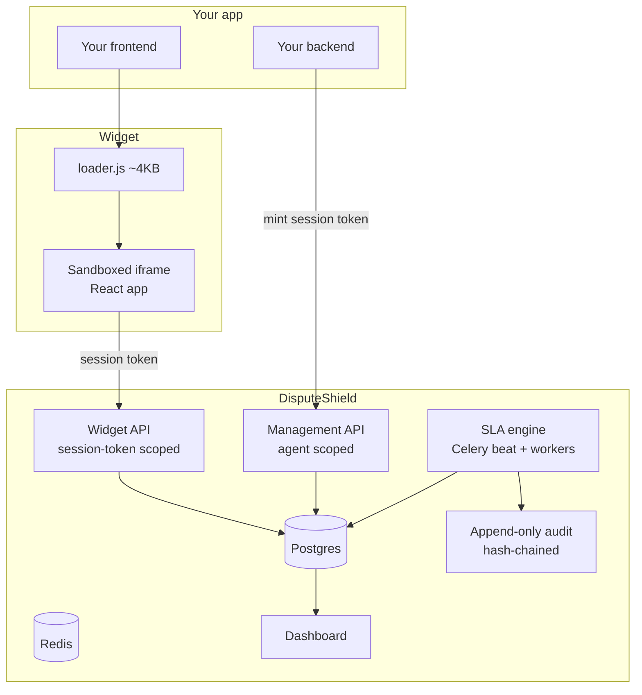
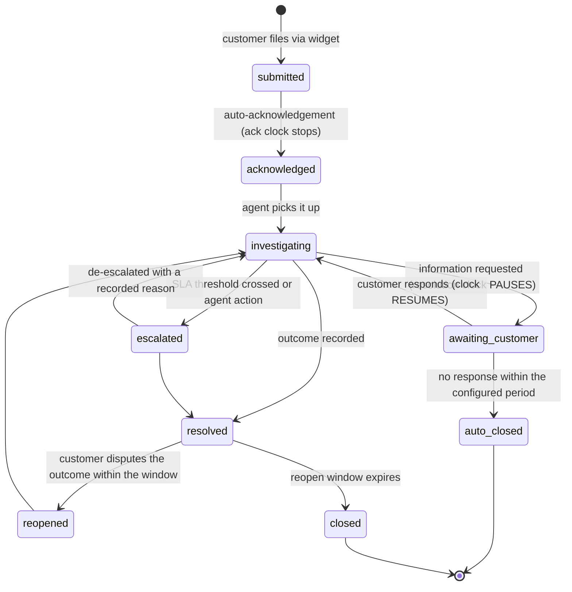

# DisputeShield

Embeddable dispute and SLA management for fintechs.

DisputeShield is a script tag you drop into your app. It gives your customers a
dispute-filing interface, and gives your compliance team an SLA-tracked,
immutably audited case management system — without you building a ticketing
system.

Integration is one script tag plus one server-side call to mint a session token.
No database changes. No new internal tool to operate.

**Nobody builds their own live chat widget. Nobody should build their own
regulated dispute workflow either** — the SLA clock, the immutable evidence
trail and the regulator-ready export are the hard parts, and they are identical
for every fintech.

---

## 1. The problem

Complaint handling in fintech is regulated. There are mandated acknowledgement
and resolution windows, mandated record-keeping, and a supervisory expectation
that a firm can produce evidence of exactly how a complaint was handled and
when.

In practice, at most fintechs:

- Complaints arrive by email, in-app chat, WhatsApp, X and phone, and end up in
  a shared inbox.
- **There is no clock.** Nobody knows which complaint is closest to breaching
  until it has already breached.
- Transaction context is not attached, so an agent asks an engineer to look
  something up, which takes hours.
- The audit trail is whatever the email thread happens to contain, and every
  message in it is editable and deletable.
- The regulatory report is assembled by hand, from memory, under time pressure,
  after the request arrives.

### Why the obvious alternatives fail

| Requirement | Generic helpdesk | Build in-house |
|---|---|---|
| SLA clock tied to a regulatory window, business-hours and holiday aware | Configurable in principle; almost nobody configures it correctly | 3–6 engineer-months for the correct version |
| Immutable audit trail usable as regulatory evidence | Records are editable and deletable by admins — fatal | Rarely built; append-only is unintuitive to implement |
| Transaction context automatically attached | Custom integration work | Possible, but it is another project |
| Regulator-ready export | Manual assembly | Another project again |
| Cost | Per-agent pricing at fintech support scale | The opportunity cost of your roadmap |

So the fintech either overpays for a poor fit or ships a half-finished internal
tool that nobody owns. DisputeShield is the third option.

| | Before | With DisputeShield |
|---|---|---|
| Time to stand up regulated dispute handling | 3–6 engineer-months | 30 minutes |
| SLA breaches per month | Unmeasured | Measured, alerted **before** breach |
| Median time to first response | Hours to days | Minutes — acknowledgement is automatic |
| Time to produce a regulatory evidence pack | Days | One export |
| Agent time spent gathering transaction context | ~40% of handling time | Near zero — attached at filing |

### What it is not

**DisputeShield never moves money.** It records an outcome, including a refund
amount, and it has no code path to a payment. That is a permanent scope
decision, not a v1 limitation, and phase 9 enforces it with a call-graph test —
because the credibility of an evidence system depends on it having no ability to
act on the thing it holds evidence about.

**DisputeShield holds no card data.** The SDK strips it at source and the server
independently rejects any payload containing a 13–19 digit string that passes a
Luhn check. PCI-DSS is out of scope by design, and the claim holds because it is
enforced rather than asserted.

**DisputeShield is not an omnichannel helpdesk.** The moment it handles "where
is my card?" it competes with Zendesk on Zendesk's terms and loses the
regulated-dispute focus that is the entire argument.

---

## 2. How it works



### The case lifecycle



Every transition writes an audit record with actor, timestamp, reason **and the
state of the SLA clock at that moment**. That last field is what makes a breach
explainable six months later.

---

## 3. Quickstart

### Hosted

```html
<script src="https://widget.disputeshield.dev/v1/loader.js"></script>
<script>
  DisputeShield.init({
    publishableKey: 'pk_live_...',
    sessionToken: '{{ session_token_from_your_backend }}',
    theme: { primary: '#0B5FFF', radius: '8px', logo: 'https://...' },
    locale: 'en-NG',
    position: 'bottom-right',
  });
</script>
```

Your backend mints the session token. This is the call that decides what the
customer can see:

```http
POST /v1/sessions
Authorization: Bearer ds_live_sk_...

{
  "customer_ref": "usr_9931",
  "display_name": "A. Okafor",
  "transactions": [
    { "reference": "TXN-2026-08-11-8842", "amount_minor": 5000000,
      "currency": "NGN", "occurred_at": "2026-08-11T09:14:22Z",
      "description": "Transfer to GTBank ****4421", "status": "failed" }
  ],
  "ttl_seconds": 1800
}
```

**DisputeShield never queries your database and holds no standing access to it.**
You supply the transaction list at mint time. The safest data is the data we
never held.

### As a Django app

```bash
pip install disputeshield
```

```python
INSTALLED_APPS = [..., "rest_framework", "disputeshield"]

DISPUTESHIELD = {
    "TENANT_MODEL": "accounts.Organisation",   # or use the bundled tenant model
    "WIDGET_ORIGIN": "https://app.acme.io",    # sets frame-ancestors
    "ENCRYPTION_KEY_REF": "kms://...",
}

urlpatterns = [..., path("disputes/", include("disputeshield.urls"))]
```

```bash
python manage.py migrate disputeshield
python manage.py disputeshield_init      # categories, calendars, default SLA policy
python manage.py disputeshield_doctor    # grants, trigger, RLS, clock skew
```

### Self-hosted

```bash
curl -fsSL https://get.disputeshield.dev/compose.yml -o docker-compose.yml
docker compose up
```

### Client packages

```bash
npm install @disputeshield/react        # React component + provider
npm install @disputeshield/node         # server-side token minting
pip install disputeshield-client        # server-side token minting
```

---

## 4. The decisions worth knowing about

Four choices shape everything else. Each has an ADR in [`docs/adr/`](docs/adr/).

### The widget runs in a sandboxed cross-origin iframe

An inline widget shares the host page's JavaScript context and DOM. On a page
that handles money that means the widget can read form fields containing
financial data, **and** a compromised host page can read the widget's session
token.

The iframe is a browser-enforced boundary in both directions. It is not
something you have to trust us to get right — you can verify it in devtools in
ten seconds.

There is no inline fallback. A fallback that degrades to the insecure mode under
conditions nobody tests *is* the insecure mode. → [ADR-0001](docs/adr/0001-sandboxed-iframe-widget.md)

The loader is **1,035 bytes gzipped** — a quarter of its budget — and CI fails
the build if it grows past 4 KB. That budget protects reviewability, not
performance: it is the only DisputeShield code that runs in your page, and it
stays small enough for your engineer to read in full before shipping it.

### The publishable key can read nothing

It loads configuration and theming. Every data operation requires a server-minted
session token scoped to exactly one customer, because the scope decision belongs
on your backend, where identity is actually known. A customer cannot see another
customer's disputes by tampering with the frontend, because the frontend was
never trusted with the question.

Tokens are opaque and Redis-backed rather than JWTs, so they can be revoked —
one session, every session for a customer, or every session minted by one key.
The last is your response to a leaked secret key, and it works immediately rather
than after a rotation completes. → [ADR-0002](docs/adr/0002-opaque-session-tokens.md)

The token reaches the widget over `postMessage`, after the widget announces it is
listening, addressed to the widget's own origin — **never in the iframe's URL**,
where it would end up in logs, referrers and browser history.

### A pausable clock is an abusable clock

`awaiting_customer` pauses the resolution clock, which is correct: it is not the
firm's fault that a customer has not replied. It is also the obvious way to dodge
a breach.

So every pause requires a reason, writes an audit record carrying the clock state
at that instant, and contributes to a pause-duration metric that is reported by
agent in the breach analysis view. The incentive is handled in the product, not
in a policy document nobody reads.

### The scheduler is the most safety-critical component

In most systems a stalled background scheduler is an inconvenience. Here it means
SLA clocks stopped advancing, warnings were never sent, and breaches occurred
undetected. It is an outage of the compliance function itself — the exact thing
you bought the product to prevent — and **it is invisible from the outside**,
because the API stays up and the dashboard keeps rendering.

Hence `disputeshield_sla_sweep_heartbeat`, a dead-man's switch that pages after
three minutes, the tightest SLO in the product, and the longest runbook.

---

## 5. Evidence, not logging

Every state change is an immutable audit record. This is the difference between
a system that logs and a system that produces evidence.

```json
{
  "id": "aud_01HQ...",
  "event_type": "dispute.resolved",
  "occurred_at": "2026-08-11T09:14:22.481Z",
  "actor":   { "type": "user", "id": "agt_...", "ip": "..." },
  "subject": { "type": "dispute", "id": "dsp_..." },
  "payload": { },
  "prev_hash": "sha256:...",
  "hash": "sha256:..."
}
```

**Immutability is enforced, not promised:**

- The application role holds `INSERT` and `SELECT` on the audit table. No
  `UPDATE`, no `DELETE`.
- A `BEFORE UPDATE OR DELETE` trigger raises regardless of the role attempting
  it, so even a superuser mistake fails loudly.
- Each record's hash covers its content plus its predecessor's hash, per tenant.
  Tampering anywhere invalidates every record after it.
- The chain is built **synchronously, inside the same transaction as the domain
  write**. There is no window in which a record exists outside the chain.
  → [ADR-0003](docs/adr/0003-audit-chain-on-the-write-path.md)
- A nightly job walks each chain and publishes a signed checkpoint.
  `GET /v1/audit/verify` exposes the proof so you or your auditor can check it
  independently.
- Records are replicated to object storage with a write-once lock, so
  immutability survives a full database compromise.
- **Corrections are appended, never applied.** A wrong record is followed by a
  compensating record carrying `corrects: <id>`. The original stays.

And because claiming immutability and having it are different things:

```bash
python manage.py disputeshield_doctor --strict
```

verifies that the trigger actually installed and that the app role really lacks
those grants. A self-hosted deployment where that migration silently failed would
otherwise have an audit trail that is immutable only by convention — and no way
to know.

---

## 6. Tenancy

Multi-tenant from the first commit, even launching with one customer. Retrofitting
tenancy is a rewrite; building it in costs a day.

Three independent layers, because one layer is a single point of failure:

1. **Authentication** — an API key resolves to exactly one tenant. No key spans
   tenants. Ever.
2. **Query** — every model uses a `TenantScopedManager` whose `get_queryset()`
   *raises* unless a tenant context is set. No default manager returns unscoped
   rows, so a forgotten filter fails loudly in development rather than leaking
   quietly in production.
3. **Storage** — Postgres RLS keyed on a session variable, so a query that
   forgets to scope returns nothing.

Layer 3 has a trap that is invisible without a connection pooler in front of
Postgres: a session variable set with plain `SET` survives into the next request
that reuses the connection. DisputeShield uses `SET LOCAL` inside the request's
transaction, and **the isolation suite runs through PgBouncer in
transaction-pooling mode**, because against Postgres directly the bug cannot be
reproduced. → [ADR-0005](docs/adr/0005-rls-under-transaction-pooling.md)

**Cross-boundary reads return 404, never 403.** A 403 confirms the resource
exists, which is an information leak. This is a project-wide exception handler,
not a convention every view has to remember.

---

## 7. API

```http
POST  /v1/sessions                            # your backend, secret key

GET   /v1/widget/config                       # theme, categories, locale
POST  /v1/widget/disputes                     # session-token scoped throughout
GET   /v1/widget/disputes
GET   /v1/widget/disputes/{id}
POST  /v1/widget/disputes/{id}/messages
POST  /v1/widget/disputes/{id}/attachments

GET   /v1/disputes?status=&category=&assigned_to=&sla_risk=&cursor=
PATCH /v1/disputes/{id}                       # status, assignment, priority — audited
POST  /v1/disputes/{id}/pause                 # {"reason": "..."} — required
POST  /v1/disputes/{id}/resume
POST  /v1/disputes/{id}/resolve               # outcome, notes, refund_amount_minor
POST  /v1/disputes/{id}/context
GET   /v1/sla-policies    POST /v1/sla-policies    PATCH /v1/sla-policies/{id}
GET   /v1/analytics/sla-performance?from=&to=&group_by=category|agent
GET   /v1/reports/regulatory?from=&to=&format=csv|pdf
GET   /v1/audit/verify
GET   /healthz   GET /readyz   GET /metrics
```

Full OpenAPI 3.1 at [`docs/openapi.yaml`](docs/openapi.yaml).

Widget and management responses never share a serializer. The widget serializer
has **no field path** that can reach internal content, and a test introspects the
full field graph to prove it — sampling outputs is not sufficient, because a
future field could open a path no sample exercises.

---

## 8. Operations

| Component | Notes |
|---|---|
| Web | Gunicorn with gevent behind nginx, HPA on RPS |
| Celery `sla` worker | Short, latency-sensitive. Separate pool — must never queue behind slow work |
| Celery `notify` worker | I/O-bound, tolerant of delay |
| Celery beat | **Exactly one replica, holding a leader lock.** Two schedulers double-fire every task |
| Widget bundle | Static, CDN, content-hashed, cached for a year |
| Postgres | Managed, PITR, read replica. Analytics and exports run against the replica only |
| Redis | **Broker and cache on separate instances**, so a cache flush cannot destroy the task queue |

### The alerts that page

| Alert | Condition | First action |
|---|---|---|
| **SLA sweep stalled** | no heartbeat for 3 min | The compliance clock has stopped — [runbook](docs/runbook-sla-sweep.md) |
| Breach imminent | any case past 95% of its window | Escalate to the tenant's support lead |
| Widget error rate | > 1% of loads | Customers cannot file complaints |
| Audit chain verification failed | any | Security incident — freeze, snapshot, invoke IR |

### Service levels

| SLI | SLO |
|---|---|
| Widget availability | 99.9% — if it will not load, customers cannot file |
| Widget p95 load | < 500 ms |
| Management API availability | 99.5% |
| **SLA sweep freshness** | **heartbeat within 120 s, 99.99% of the time** |

Sweep freshness is the strictest number in the product, deliberately.

### Recovery

RPO 5 minutes, RTO 1 hour. Restores are tested monthly into an isolated
environment and verified by reconstructing a known case's full history and
checking its hash chain — a backup nobody has restored is a hypothesis.

---

## 9. Development

```bash
make install       # venv, dependencies, pre-commit hooks
make up            # Postgres, PgBouncer, two Redis instances, Mailpit
make migrate
make doctor        # verify grants, trigger, RLS, clock skew
make hello         # empty database to a filed dispute with a computed deadline
make ci            # everything CI runs
```

`make ci` is the gate, and it is the same set of targets CI runs — if they
diverge, CI is lying.

### The gates that never go yellow

```bash
make gates       # the blocking suites
make packaging   # wheel -> bare project -> init -> doctor -> file a dispute
make browser     # iframe isolation, keyboard-only filing, axe
```

| Gate | Asserts |
|---|---|
| Tenant and customer isolation | Cross-boundary reads return 404, never 403 |
| Database-level immutability | `UPDATE`/`DELETE` on audit raises **in Postgres**, not just the ORM |
| No edit or delete path | No route resolves to a mutation of an auditable record |
| Serializer leakage | No field path from customer-facing output to internal content |
| Widget isolation | Neither side of the iframe boundary can reach the other |
| No money movement | No call path from any module to a payment write |

Deadline computation gets its own attention, because every subtle bug in it is a
compliance breach nobody notices until an auditor does. The suite covers
weekends, public holidays, DST transitions in both directions, multiple pause
intervals, a pause spanning a holiday, and windows shorter than one business day —
then runs again under `TZ=Pacific/Kiritimati` to prove the answer does not depend
on where the server happens to be.

---

## 10. Roadmap

Thirteen phases, each with an exit gate a machine checks.

| Phases | Delivers | Version |
|---|---|---|
| 0–6 | The product as specified: widget, SLA engine, agent workspace, audit trail, regulatory export, packaging | **v1.0 — shipped** |
| 7 | Every complaint lands in the clock — omnichannel intake, deflection, mass-incident mode | v1.1 |
| 8 | Evidence that survives a lawyer — legal hold, chain anchoring, external escalation, regulatory returns | v1.2 |
| 9 | The money side — representment packs, provider connectors, financial exposure | v1.3 |
| 10 | Intelligence, strictly advisory — triage, copilot, root-cause clustering, repeat-claimant signals | v1.4 |
| 11 | Operating the operation — SLA simulator, QA sampling, outbound webhooks | v1.5 |
| 12 | Enterprise and adoption — residency and BYOK, migration tooling, sandbox and simulator | v2.0 |

Phases 0–6 are a complete, shippable product. Nothing in 7–12 is a prerequisite
for anything in them, so the cut line is obvious and lands somewhere defensible.

- [`docs/ROADMAP.md`](docs/ROADMAP.md) — the phases and their exit gates
- [`docs/AMPLIFIERS.md`](docs/AMPLIFIERS.md) — the twenty capabilities beyond v1.0, each with the guardrail that makes it shippable

---

## 11. Documentation

| Document | What it is for |
|---|---|
| [`docs/product-specification.md`](docs/product-specification.md) | The complete specification — business case, personas, architecture, threat model, operations |
| [`docs/plan-architecture.md`](docs/plan-architecture.md) | The decisions the specification left open, each with its cost |
| [`docs/ROADMAP.md`](docs/ROADMAP.md) | Thirteen phases and the gates that close them |
| [`docs/AMPLIFIERS.md`](docs/AMPLIFIERS.md) | Twenty capabilities beyond v1.0 |
| [`docs/adr/`](docs/adr/) | Architecture decision records |
| [`docs/runbook-sla-sweep.md`](docs/runbook-sla-sweep.md) | The most important runbook in the product |
| [`DESIGN.md`](DESIGN.md) | The design system. Read before any visual decision |

---

## 12. Compliance mapping

| Requirement | How DisputeShield addresses it |
|---|---|
| Acknowledgement and resolution within mandated windows | SLA engine with per-category windows, business-hours calendars, pre-breach alerting, breach recording |
| Complaint record-keeping and retrievability | 7-year retention, full case history, regulator-ready export with integrity attestation |
| Demonstrable evidence of how a complaint was handled | Every message, status change, assignment and clock event is an immutable audit record naming the actor |
| Accessibility of complaint channels | WCAG 2.1 AA, tested in CI including a keyboard-only walkthrough |
| Audit trail integrity | Append-only store, hash chain, signed checkpoints, object-lock replication |
| Data protection and subject rights | Minimisation by class, documented and tested export and deletion procedures |
| Cardholder data | **Out of scope by design.** Card data is never collected — a deliberate scope reduction, not an omission |

---

## License

[Business Source License 1.1](LICENSE). Converts to Apache 2.0 on 2030-08-23.

You may run DisputeShield in production to handle disputes belonging to you or
your own customers. You may not offer DisputeShield itself to third parties as a
hosted dispute-management service. The client libraries in `sdk/` and the loader
in `loader/` are Apache-2.0, so integrating never requires reference to these
terms.
