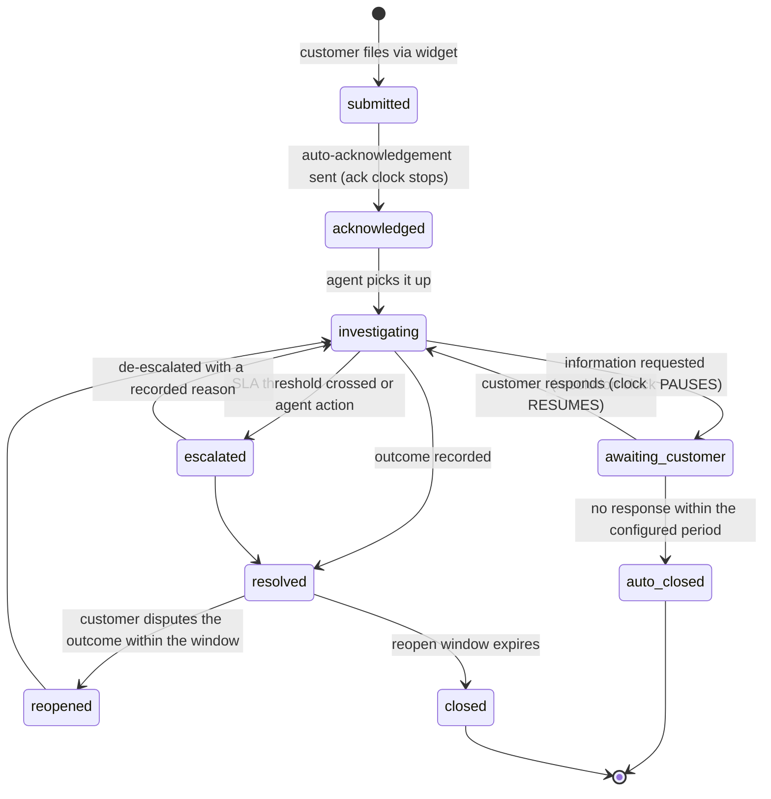
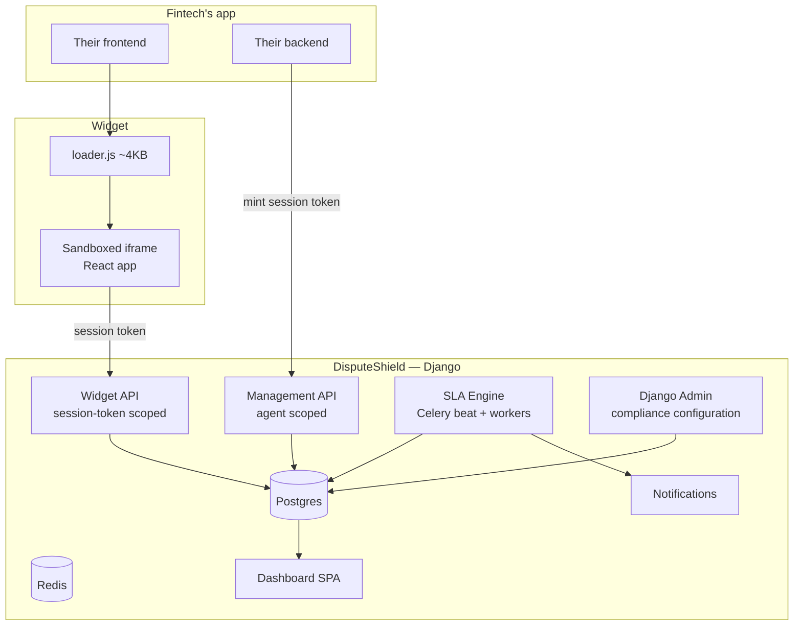

# DisputeShield

### Embeddable Dispute & SLA Management for Fintechs

**Repository:** `github.com/disputeshield/disputeshield` — standalone project, independent release cycle
**Stack:** Python 3.12, Django 5, DRF, Celery, Postgres 16, Redis; React for the widget and dashboard
**Document type:** Complete product specification — business analysis, product management, architecture, engineering, security, DevOps
**Version:** 1.0

---

## 1. What DisputeShield is

**One line:** DisputeShield is a script tag a fintech drops into their app that gives their customers a dispute-filing interface, and gives their compliance team an SLA-tracked, immutably audited case management system — without them building a ticketing system.

**Integration cost:** one script tag or one npm package, plus one server-side call to mint a session token. Under thirty minutes. No database changes, no new internal tool to operate.

**The analogy that sells it:** nobody builds their own live chat widget. Nobody should build their own regulated dispute workflow either — the SLA clock, the immutable evidence trail and the regulator-ready export are the hard parts, and they are identical for every fintech.

### 1.1 Repository scope

Self-contained project with its own repository, versioning, release pipeline, dashboard and hosted deployment. It depends on no sibling product and nothing in this document lives outside this repository.

```
disputeshield/
├── disputeshield/            # the installable Django app (PyPI: disputeshield)
│   ├── models/               # disputes, messages, SLA, audit
│   ├── api/                  # DRF viewsets — widget API + management API
│   ├── sla/                  # deadline computation, clock, sweep tasks
│   ├── audit/                # append-only trail, hash chain
│   ├── tenancy/              # scoped managers, RLS helpers
│   ├── admin.py              # compliance configuration surface
│   ├── migrations/
│   └── apps.py
├── server/                   # standalone Django project wrapping the app
├── widget/                   # React app served in a sandboxed iframe
├── loader/                   # ~4KB loader.js published to CDN
├── sdk/
│   ├── node/                 # @disputeshield/node — server-side token minting
│   ├── react/                # @disputeshield/react
│   └── python/               # disputeshield-client
├── dashboard/                # React SPA — agent workspace + compliance views
├── deploy/{docker,helm,terraform}/
├── docs/adr/
└── .github/workflows/
```

The Django app and the standalone server are separate deliverables on purpose — see §6.

---

## 2. Business analysis

### 2.1 The problem

Complaint handling in fintech is regulated. There are mandated acknowledgement and resolution windows, mandated record-keeping, and a supervisory expectation that a firm can produce evidence of exactly how a complaint was handled and when. In practice, at most fintechs:

- Complaints arrive by email, in-app chat, WhatsApp, Twitter and phone, and end up in a shared inbox.
- There is no clock. Nobody knows which complaint is closest to breaching until it has already breached.
- Transaction context is not attached, so an agent asks an engineer to look something up, which takes hours.
- The audit trail is whatever the email thread happens to contain, and every message in it is editable and deletable.
- The regulatory report is assembled by hand, from memory, under time pressure, after the request arrives.

### 2.2 Why the obvious alternatives fail

| Requirement | Generic helpdesk (Zendesk, Freshdesk) | Build in-house |
|---|---|---|
| SLA clock tied to a regulatory window, business-hours and holiday aware | Configurable in principle; almost nobody configures it correctly | 3–6 engineer-months for the correct version |
| Immutable audit trail usable as regulatory evidence | Records are editable and deletable by admins — fatal | Rarely built; append-only is unintuitive to implement |
| Transaction context automatically attached | Requires custom integration work | Possible, but it is another project |
| Regulator-ready export | Manual assembly | Another project again |
| Financial data residency and minimisation | Frequently a procurement blocker | Under your control, but under-specified |
| Cost | Per-agent pricing at fintech support scale is significant | Opportunity cost of the roadmap |

So the fintech either overpays for a poor fit or ships a half-finished internal tool that nobody owns. DisputeShield is the third option.

### 2.3 Business impact

| Impact | Detail |
|---|---|
| **Regulatory** | Missed complaint-resolution windows are a direct, documented penalty exposure |
| **Evidentiary** | In a supervisory review, "we cannot prove what we did" is treated as "we did not do it" |
| **Operational** | Agents spend the majority of handling time gathering context rather than resolving anything |
| **Customer** | Unacknowledged complaints escalate to social media, and then to the regulator directly |
| **Compounding** | Every unhandled transaction failure becomes a dispute, and every mishandled dispute becomes a regulatory record |

### 2.4 Commercial model

| Tier | Target | Shape |
|---|---|---|
| Open core (self-hosted) | Evaluation, small teams | `pip install disputeshield`, single tenant, community support |
| Starter | Early-stage fintech | Per-seat plus per-case, 90-day retention |
| Growth | Licensed fintech | + SLA guarantees, 1-year retention, SSO, custom categories |
| Enterprise | Bank / PSSP | + on-premise, dedicated infrastructure, 7-year retention, custom workflows |

### 2.5 Success criteria

| Metric | Before | With DisputeShield |
|---|---|---|
| Time to stand up regulated dispute handling | 3–6 engineer-months | 30 minutes |
| SLA breaches per month | Unmeasured | Measured, alerted before breach, trending to zero |
| Median time to first response | Hours to days | Minutes — acknowledgement is automatic |
| Time to produce a regulatory evidence pack | Days | One export |
| Agent time spent gathering transaction context | ~40% of handling time | Near zero — attached at filing |

---

## 3. Product management

### 3.1 Personas

**Adaeze — Head of Compliance.** Non-technical, accountable for the regulatory relationship, measured on zero fines and clean reviews. Wants to change an SLA policy without filing a ticket. Lives in a dashboard, never in a terminal.

**Ngozi — Customer Support Lead.** Runs the complaint queue. Needs to know which cases are about to breach, and needs transaction context attached without asking an engineer.

**Tunde — Senior Backend Engineer.** Will integrate it. Will read the loader script before putting it on a page that handles money, and will reject anything that can read his DOM.

**Ibrahim — Platform Engineer.** Will be paged when the SLA scheduler stops. Needs to understand what that means before it happens.

### 3.2 User stories

**Epic A — Customer-facing widget**

> **A1.** As a fintech's customer, I want to raise a dispute from inside the app I am already using, rather than hunting for an email address.
> *AC:* Loads in under 500 ms, works on mobile, never blocks the host page, fully keyboard navigable and screen-reader accessible to WCAG 2.1 AA.

> **A2.** As a fintech's customer, I want to pick the transaction I am disputing from a list, so I do not have to type a reference I cannot find.
> *AC:* Recent transactions supplied by the host application when the session token is minted. Only that customer's transactions are ever visible.

> **A3.** As a fintech's customer, I want to see my dispute's status and expected resolution date, so I stop having to chase.
> *AC:* Status timeline in the widget; expected resolution derived from the applicable SLA policy; updates without a page refresh.

> **A4.** As a fintech's engineer, I want the widget to match my brand so it does not look bolted on.
> *AC:* Theming via configuration — colours, radius, font, logo, position, locale. No CSS leakage in either direction.

**Epic B — Agent workspace**

> **B1.** As a support agent, I want a queue sorted by SLA urgency, so I always work the most at-risk case first.
> *AC:* Default sort is time-remaining ascending. Breached cases pinned at the top and visually distinct. Filters by status, category, assignee and amount band.

> **B2.** As a support agent, I want transaction context on the case without asking an engineer.
> *AC:* Context is pushed by the host application at filing time or via `POST /v1/disputes/{id}/context`. Displayed as a timeline alongside the conversation.

> **B3.** As a support agent, I want templated responses and internal notes so I am fast and consistent.
> *AC:* Templates support variable substitution. Internal notes are clearly separated from customer-visible messages and are structurally incapable of reaching the widget.

> **B4.** As a support lead, I want cases assigned and escalated automatically, so nothing sits unowned.
> *AC:* Round-robin or category-based assignment. Auto-escalation at configurable SLA thresholds. Reassignment when an agent is unavailable.

**Epic C — SLA engine**

> **C1.** As a compliance officer, I want SLA policies per dispute category, because a card chargeback and a failed airtime purchase have different regulatory windows.
> *AC:* Policies define acknowledgement window, resolution window, business-hours calendar, holiday calendar and escalation thresholds. Editable without a deploy.

> **C2.** As a compliance officer, I want to be alerted before a breach, not after.
> *AC:* Configurable warning thresholds, defaulting to 50%, 80% and 95% of the window. Alerts to email, Slack and the dashboard.

> **C3.** As a compliance officer, I want the clock to pause when we are legitimately waiting on the customer.
> *AC:* An `awaiting_customer` state pauses the resolution clock. Every pause and resume is an audit record carrying a mandatory reason.

**Epic D — Compliance and evidence**

> **D1.** As a compliance officer, I want an immutable record of every action on every case, with no edit or delete path anywhere in the product — including the admin.
> **D2.** As a compliance officer, I want a regulator-ready export for any period, including case volumes, categories, resolution times, breach counts with reasons, and per-case history with an integrity attestation.
> **D3.** As a compliance officer, I want breach trends by category and by agent, so I can fix causes rather than symptoms.

### 3.3 Scope for v1.0

| Must | Should | Could | Won't (v1) |
|---|---|---|---|
| Embeddable widget (script tag and React package) | Response templates | Live chat | Being a full omnichannel helpdesk |
| Case lifecycle and status workflow | Auto-assignment and escalation | Satisfaction surveys | Knowledge base |
| SLA engine with business hours and holidays | Breach analytics | Sentiment or priority prediction | Telephony |
| Agent workspace | File attachments with AV scanning | Additional languages | Executing refunds or moving money |
| Immutable audit trail | Slack and email alerting | | |
| Regulator-ready export | Transaction context API | | |
| Multi-tenancy and isolation | | | |

### 3.4 Case lifecycle



Every transition writes an audit record with actor, timestamp, reason and the state of the SLA clock at that moment. That last field is what makes a breach explainable six months later.

---

## 4. Architecture

### 4.1 Components



### 4.2 The widget boundary — the security-critical decision

```
loader.js (~4KB, runs on the host page)
  └─ creates a sandboxed cross-origin <iframe>
       └─ the full React app runs INSIDE the iframe
            └─ which talks to the DisputeShield API using a session token
```

**Why an iframe rather than inline React.** An inline widget shares the host page's JavaScript context and DOM. On a fintech page, that means the widget can read form fields containing financial data, and a compromised host page can read the widget's session token. The iframe is a browser-enforced boundary in both directions, and it is not something the customer has to trust us to get right — they can verify it in devtools in ten seconds.

```html
<iframe
  src="https://widget.disputeshield.dev/v1/embed?k=pk_live_..."
  sandbox="allow-scripts allow-forms allow-same-origin"
  allow=""
  referrerpolicy="strict-origin">
</iframe>
```

Host and widget communicate by `postMessage` with strict origin checking on both sides and a fixed message schema. Never `'*'` as a target origin — that is the single most common way widget integrations leak data.

### 4.3 The token model

```
1. The host backend calls  POST /v1/sessions  using its secret key (server-side only)
      body: { customer_ref, transactions: [...], display_name }
   → returns a session token, 30-minute TTL, scoped to exactly that one customer

2. The host frontend initialises the widget with the publishable key + session token

3. The widget calls the widget API using the session token only
```

The publishable key can do nothing but load configuration and theming. Every data operation requires a server-minted session token. This means a customer cannot see another customer's disputes even by tampering with the frontend, because the scope was decided on the fintech's own backend where the identity is actually known.

### 4.4 The SLA engine

```python
class SLAPolicy(models.Model):
    tenant = models.ForeignKey(Tenant, on_delete=models.PROTECT)
    category = models.CharField(max_length=64)
    acknowledgement_minutes = models.PositiveIntegerField(default=60)
    resolution_hours = models.PositiveIntegerField(default=72)
    business_hours_only = models.BooleanField(default=True)
    calendar = models.ForeignKey('BusinessCalendar', on_delete=models.PROTECT)
    warning_thresholds = models.JSONField(default=list)      # [50, 80, 95]
    escalate_at_percent = models.PositiveIntegerField(default=80)
    regulatory_reference = models.CharField(max_length=255, blank=True)
    # e.g. "CBN Consumer Protection Framework s.4.2" — this field turns a
    # configuration value into documented evidence of intent, which is what
    # a supervisor actually asks about.
```

```python
def compute_deadline(start: datetime, hours: int, calendar: BusinessCalendar,
                     paused_intervals: list[tuple[datetime, datetime]]) -> datetime:
    """Walk forward through business time, skipping non-business hours,
    weekends, public holidays and paused intervals.

    All arithmetic is performed in UTC; calendar boundaries are resolved in the
    calendar's own timezone. Pure and side-effect free, so it is exhaustively
    unit-testable — which matters because every subtle bug in this function is
    a compliance breach that nobody notices until an auditor does.
    """
```

A Celery beat task sweeps every minute for cases crossing a warning threshold or a breach boundary. The sweep is idempotent: a notification is recorded before it is sent, so a retry cannot double-notify, and a missed window can be replayed in catch-up mode.

---

## 5. Data model

```python
class Dispute(models.Model):
    id = models.CharField(primary_key=True, max_length=32)      # dsp_...
    tenant = models.ForeignKey(Tenant, on_delete=models.PROTECT, db_index=True)
    reference = models.CharField(max_length=32)                 # human-facing
    customer_ref_hash = models.CharField(max_length=64, db_index=True)
    customer_display_name = models.CharField(max_length=128, blank=True)

    category = models.CharField(max_length=64)
    subcategory = models.CharField(max_length=64, blank=True)
    description = models.TextField()
    transaction_ref = models.CharField(max_length=128, blank=True, db_index=True)
    amount_minor = models.BigIntegerField(null=True)            # integer minor units
    currency = models.CharField(max_length=3, blank=True)

    status = models.CharField(max_length=32, db_index=True)
    priority = models.CharField(max_length=16, default='normal')
    assigned_to = models.ForeignKey('Agent', null=True, on_delete=models.SET_NULL)

    sla_policy = models.ForeignKey(SLAPolicy, on_delete=models.PROTECT)
    submitted_at = models.DateTimeField()
    acknowledged_at = models.DateTimeField(null=True)
    ack_deadline = models.DateTimeField(db_index=True)
    resolution_deadline = models.DateTimeField(db_index=True)
    paused_seconds = models.PositiveIntegerField(default=0)
    resolved_at = models.DateTimeField(null=True)
    closed_at = models.DateTimeField(null=True)

    breach_ack = models.BooleanField(default=False)
    breach_resolution = models.BooleanField(default=False)
    breach_reason = models.TextField(blank=True)

    outcome = models.CharField(max_length=32, blank=True)  # upheld|rejected|partial|withdrawn
    outcome_notes = models.TextField(blank=True)
    refund_amount_minor = models.BigIntegerField(null=True)   # recorded, never executed

    objects = TenantScopedManager()      # §8.1 — no unscoped access path exists

    class Meta:
        unique_together = [('tenant', 'reference')]
        indexes = [
            models.Index(fields=['tenant', 'status', 'resolution_deadline']),
            models.Index(fields=['tenant', 'assigned_to', 'status']),
        ]


class DisputeMessage(models.Model):
    dispute = models.ForeignKey(Dispute, related_name='messages', on_delete=models.PROTECT)
    author_type = models.CharField(max_length=16)      # customer|agent|system
    author_id = models.CharField(max_length=64, blank=True)
    visibility = models.CharField(max_length=16)       # customer|internal
    body = models.TextField()
    created_at = models.DateTimeField(auto_now_add=True)
    # No updated_at and no edit path anywhere. Messages are immutable by design;
    # a correction is a new message, never a rewrite of an old one.


class DisputeAttachment(models.Model):
    dispute = models.ForeignKey(Dispute, related_name='attachments', on_delete=models.PROTECT)
    uploaded_by_type = models.CharField(max_length=16)
    filename = models.CharField(max_length=255)
    content_type = models.CharField(max_length=128)
    size_bytes = models.PositiveIntegerField()
    sha256 = models.CharField(max_length=64)
    storage_key = models.CharField(max_length=512)     # private object storage
    scan_status = models.CharField(max_length=16, default='pending')
    created_at = models.DateTimeField(auto_now_add=True)
    # Not retrievable by anyone until scan_status == 'clean'.


class SLAEvent(models.Model):
    """Every clock event: started, paused, resumed, warned, breached."""
    dispute = models.ForeignKey(Dispute, related_name='sla_events', on_delete=models.PROTECT)
    event_type = models.CharField(max_length=32)
    reason = models.TextField(blank=True)
    actor_id = models.CharField(max_length=64, blank=True)
    clock_remaining_seconds = models.IntegerField()
    occurred_at = models.DateTimeField()


class AuditRecord(models.Model):
    """Append-only per §8.3. INSERT and SELECT grants only; a database trigger
    blocks UPDATE and DELETE; records are hash-chained per tenant."""
    class Meta:
        default_permissions = ()     # no change or delete permission can be granted
```

**`on_delete=models.PROTECT` everywhere.** `CASCADE` on a compliance system means a single mistaken tenant deletion silently destroys evidence. `PROTECT` forces deletion to be a deliberate, documented act — which is exactly what it should be.

---

## 6. Installation and distribution

DisputeShield ships in three forms, because three genuinely different customers exist: the team that wants a hosted service, the team that wants to run it themselves, and the team that already has Django and would rather it just be part of their project.

### 6.1 Hosted

Sign in at `app.disputeshield.dev`, create a project, copy the publishable and secret keys, add the script tag. Nothing to run. This is what the documentation leads with.

### 6.2 As an installable Django app

This is the distribution mode that makes DisputeShield feel native to a Python team. It installs into an existing Django project like any other reusable app.

```bash
pip install disputeshield
```

```python
# settings.py
INSTALLED_APPS = [
    ...
    "rest_framework",
    "disputeshield",
]

DISPUTESHIELD = {
    "TENANT_MODEL": "accounts.Organisation",   # or use the bundled tenant model
    "WIDGET_ORIGIN": "https://app.acme.io",    # sets frame-ancestors
    "ENCRYPTION_KEY_REF": "kms://...",
    "DEFAULT_SLA_POLICY": {"resolution_hours": 72, "business_hours_only": True},
}
```

```python
# urls.py
urlpatterns = [
    ...
    path("disputes/", include("disputeshield.urls")),
]
```

```bash
python manage.py migrate disputeshield
python manage.py disputeshield_init      # seeds categories, calendars, default SLA policy
python manage.py disputeshield_doctor    # checks DB grants, trigger install, Redis, clock skew
```

The Celery tasks register automatically; the customer adds one beat schedule entry:

```python
CELERY_BEAT_SCHEDULE = {
    "disputeshield-sla-sweep": {
        "task": "disputeshield.sla.sweep",
        "schedule": crontab(minute="*"),
    },
}
```

`disputeshield_doctor` verifies that the audit table's `UPDATE`/`DELETE` trigger actually installed and that the application database role lacks those grants. A self-hosted deployment where that migration silently failed would have an audit trail that is not actually immutable — and the customer would have no way to know. Checking it explicitly, and refusing to start in strict mode if it fails, is the difference between claiming immutability and having it.

### 6.3 Self-hosted standalone server

For teams who want DisputeShield as its own service rather than inside their application.

```bash
docker run -d --name disputeshield \
  -e DISPUTESHIELD_DATABASE_URL="postgres://..." \
  -e DISPUTESHIELD_REDIS_URL="redis://..." \
  -e DISPUTESHIELD_SECRET_KEY_REF="kms://..." \
  -p 8000:8000 \
  ghcr.io/disputeshield/disputeshield:1.0.0
```

```bash
curl -fsSL https://get.disputeshield.dev/compose.yml -o docker-compose.yml
docker compose up
# Postgres, Redis, web, Celery worker, Celery beat, dashboard and widget
```

```bash
helm repo add disputeshield https://charts.disputeshield.dev
helm install disputeshield disputeshield/disputeshield -f values.yaml
```

### 6.4 Client packages

```bash
npm install @disputeshield/react        # React component + provider
npm install @disputeshield/node         # server-side session token minting
pip install disputeshield-client        # server-side session token minting
```

```html
<!-- Plain script tag, no build step, works on any stack -->
<script src="https://widget.disputeshield.dev/v1/loader.js"></script>
<script>
  DisputeShield.init({
    publishableKey: 'pk_live_...',
    sessionToken: '{{ session_token_from_your_backend }}',
    theme: { primary: '#0B5FFF', radius: '8px', logo: 'https://...' },
    locale: 'en-NG',
    position: 'bottom-right',
  });
</script>
```

```jsx
import { DisputeShieldProvider, DisputeButton } from '@disputeshield/react';

<DisputeShieldProvider publishableKey={pk} sessionToken={token} theme={theme}>
  <DisputeButton transactionRef="TXN-2026-08-11-8842">
    Report a problem
  </DisputeButton>
</DisputeShieldProvider>
```

### 6.5 The dashboard

DisputeShield's dashboard at `app.disputeshield.dev`, or wherever a self-hosted deployment serves it, is where two very different users live.

| Section | For | Contents |
|---|---|---|
| **Queue** | Agents | Cases sorted by time remaining; breached cases pinned; filters by status, category, assignee, amount |
| **Case view** | Agents | Conversation, internal notes, attachments, transaction context timeline, SLA clock, full action history |
| **SLA policies** | Compliance | Windows per category, business calendars, holidays, warning thresholds, escalation rules — with change history |
| **Breach analysis** | Compliance | Breaches by category, agent and cause; pause duration analysis; trend over time |
| **Reports** | Compliance | Regulator-ready export (CSV/PDF) with per-case history and the audit-chain integrity attestation |
| **Widget** | Engineers | Theming, allowed origins, category configuration, live preview |
| **Settings** | Owners | API keys, team, SSO, retention |

Authentication is email plus TOTP, or OIDC against the customer's identity provider. Roles are Owner, Compliance, Agent and Read-only. An agent can resolve a case but cannot change an SLA policy; a compliance user can change a policy but the change is recorded, versioned and visible next to the breach data it affects.

The Django admin is a separate, more restricted surface for configuration that changes rarely: business calendars, categories, tenant provisioning. It sits behind SSO and TOTP, is IP-restricted, and every admin action is mirrored into the audit trail by a signal handler — because an admin panel that writes outside the audit trail is a hole in the evidence.

---

## 7. API contract

### 7.1 Server-side — the fintech's backend calls this

```http
POST /v1/sessions
Authorization: Bearer ds_live_sk_...

{
  "customer_ref": "usr_9931",
  "display_name": "A. Okafor",
  "transactions": [
    { "reference": "TXN-2026-08-11-8842", "amount_minor": 5000000,
      "currency": "NGN", "occurred_at": "2026-08-11T09:14:22Z",
      "description": "Transfer to GTBank ****4421", "status": "failed" }
  ],
  "ttl_seconds": 1800
}

201 Created
{ "session_token": "dst_...", "expires_at": "2026-08-11T09:44:22Z" }
```

The transaction list is supplied by the fintech at mint time. **DisputeShield never queries the fintech's database and holds no standing access to it** — another application of the principle that the safest data is the data you never held.

### 7.2 Widget API — session-token scoped

```http
GET  /v1/widget/config                        # theme, categories, locale
POST /v1/widget/disputes
GET  /v1/widget/disputes                      # only this customer's, by token scope
GET  /v1/widget/disputes/{id}
POST /v1/widget/disputes/{id}/messages
POST /v1/widget/disputes/{id}/attachments
```

### 7.3 Management API

```http
GET   /v1/disputes?status=&category=&assigned_to=&sla_risk=&cursor=
GET   /v1/disputes/{id}
PATCH /v1/disputes/{id}                       # status, assignment, priority — audited
POST  /v1/disputes/{id}/messages
POST  /v1/disputes/{id}/pause                 # {"reason": "..."} — reason is required
POST  /v1/disputes/{id}/resume
POST  /v1/disputes/{id}/resolve               # outcome, notes, refund_amount_minor
POST  /v1/disputes/{id}/context               # attach transaction/provider context
GET   /v1/sla-policies    POST /v1/sla-policies    PATCH /v1/sla-policies/{id}
GET   /v1/analytics/sla-performance?from=&to=&group_by=category|agent
GET   /v1/reports/regulatory?from=&to=&format=csv|pdf
GET   /v1/audit/verify
GET   /healthz   GET /readyz   GET /metrics
```

Full OpenAPI 3.1 specification at `docs/openapi.yaml`.

---
## 8. Foundations

> These are the DisputeShield project's own foundations. This document is self-contained — it assumes no shared platform, no sibling services and no external repository. Everything DisputeShield needs to run is defined in this repository.

### 8.1 Tenancy model

DisputeShield is multi-tenant from the first commit, even if it launches with one customer. Retrofitting tenancy is a rewrite; building it in costs a day.

Tenancy is enforced at three independent layers, because one layer is a single point of failure:

1. **Authentication layer** — an API key resolves to exactly one `tenant_id`. No key spans tenants. Ever.
2. **Query layer** — every model uses a `TenantScopedManager` whose `get_queryset()` raises unless a tenant context has been set. There is no default manager that returns unscoped rows, so a forgotten filter raises loudly in development rather than leaking quietly in production.
3. **Storage layer** — Postgres Row Level Security policies keyed on a session variable set from the authenticated tenant, so even a query that forgets to scope returns nothing.

**Mandatory test:** `tests/test_tenant_isolation.py` creates two tenants, writes data as A, and asserts that every read endpoint returns **404** when called as B. Not 403 — a 403 confirms the resource exists, which is an information leak. This suite is a required CI gate and blocks merge.

### 8.2 Authentication and keys

| Surface | Scheme |
|---|---|
| Server-to-server API | Bearer API key, format `ds_{env}_{random32}` — e.g. `ds_live_9f2a7c...` |
| Key storage | Argon2id hash. Prefix stored in plaintext for lookup and dashboard display. Shown once at creation, never retrievable. |
| Outbound webhooks | HMAC-SHA256 over `{timestamp}.{raw_body}`, header `X-DisputeShield-Signature: t=...,v1=...`. Deliberately the Stripe scheme — well documented, widely understood, and not a novel cryptographic design. |
| Dashboard | Email + TOTP, or OIDC against the tenant's IdP. Short sessions, rotated on privilege change. |
| Key rotation | Overlapping validity windows. A new key is issued and both work until the old one is explicitly revoked, so rotation never causes downtime. |

Keys are scoped per environment (`test` / `live`) and are independently revocable. A leaked test key can do nothing to live data.

### 8.3 The audit trail

Every state change in DisputeShield is recorded as an immutable audit record. This is the difference between a system that logs and a system that produces evidence.

```json
{
  "id": "aud_01HQ...",
  "tenant_id": "tnt_...",
  "event_type": "dispute.resolved",
  "occurred_at": "2026-08-11T09:14:22.481Z",
  "recorded_at": "2026-08-11T09:14:22.503Z",
  "actor":   { "type": "system|user|api_key", "id": "...", "ip": "..." },
  "subject": { "type": "...", "id": "..." },
  "payload": { },
  "prev_hash": "sha256:...",
  "hash": "sha256:..."
}
```

**Immutability is enforced, not promised:**

- The application database role has `INSERT` and `SELECT` grants on the audit table only. No `UPDATE`, no `DELETE`.
- A `BEFORE UPDATE OR DELETE` trigger raises an exception regardless of the role attempting it, so even a superuser mistake fails loudly.
- Each record's `hash` covers its own content plus the previous record's hash, forming a per-tenant hash chain. Tampering anywhere invalidates every record after it.
- A nightly job walks each tenant's chain and publishes a signed checkpoint. `GET /v1/audit/verify` exposes the proof so a customer or their auditor can check it independently.
- Audit records are replicated to object storage with a write-once lock, so immutability survives a full database compromise.
- **Corrections are appended, never applied.** A wrong record is followed by a compensating record with `corrects: <id>`. The original stays.

### 8.4 Data classification

| Class | Examples | Rule |
|---|---|---|
| **Never collect** | PAN, CVV, full card data, passwords, full BVN | The SDK strips these at source via a field denylist. The server independently rejects any payload containing a 13–19 digit string that passes a Luhn check. |
| **Pseudonymise** | Customer name, email, phone | Hashed with a per-tenant salt before storage unless the tenant explicitly opts in |
| **Store encrypted** | Dispute descriptions, messages, attachments, transaction references, amounts, agent actions, SLA clock events | Encrypted at rest with envelope encryption — a KMS master key wraps per-tenant data keys |
| **Standard** | Aggregates, configuration, rule definitions | Normal storage |

This is the section a prospective customer's security team reads first. *"We cannot leak what we never collected"* is a far stronger position than *"we encrypt it well."*

### 8.5 Security baseline

**Secrets**
- No secrets in source. `gitleaks` runs in pre-commit and as a blocking CI gate.
- Runtime secrets come from the cloud secret manager, injected as env vars or mounted files, never baked into an image.
- Every secret type has a documented maximum age and a rotation runbook.

**Secure SDLC**

| Stage | Gate |
|---|---|
| Design | Threat model updated whenever a new external interface is added |
| Pre-commit | Format, lint, `gitleaks` |
| Pull request | SAST (`bandit`, `semgrep`), dependency audit (`pip-audit`), unit tests, tenant isolation suite, coverage floor |
| Merge | Container image scan (`trivy`), SBOM generation (`syft`), image signing (`cosign`) |
| Deploy | Migrations reviewed as a separate artefact from code; canary rollout with automatic rollback on error-budget burn |
| Runtime | Nightly audit-chain verification; weekly DAST against staging |

**Dependency and vulnerability management**

DisputeShield's own dependency tree is scanned on every build against OSV and NVD. Findings are triaged against published remediation SLAs, which are stated publicly because a vendor that publishes its SLAs is easier to trust than one that does not:

| Severity | Remediation SLA |
|---|---|
| Critical | 24 hours |
| High | 7 days |
| Medium | 30 days |
| Low | 90 days |

An SBOM is generated per release and published as a build artefact, so a customer's security team can assess DisputeShield without asking.

### 8.6 Reliability principles

1. **Degrade, never block.** If DisputeShield is unavailable the widget fails closed and quietly — it does not render a broken interface on the fintech's page, and it never blocks the host page's load. The host application continues working exactly as it would if the widget were not installed.
2. **Bounded everything.** Every queue, buffer, retry sequence and payload has an explicit ceiling. Unbounded growth is the most common cause of a 3am page.
3. **Backpressure is explicit.** When capacity is exceeded the system returns 429 with `Retry-After` rather than silently queueing until it dies.
4. **Idempotency everywhere.** Every write endpoint accepts an idempotency key and returns the original result on replay.
5. **Graceful shutdown.** On `SIGTERM`: stop accepting work, drain in-flight requests, flush buffers, exit. `terminationGracePeriodSeconds` is set longer than the drain budget.

---

## 9. Compliance mapping

| Requirement | Source | How DisputeShield addresses it |
|---|---|---|
| Complaint acknowledgement and resolution within mandated windows | CBN Consumer Protection Framework | SLA engine with per-category windows, business-hours calendars, pre-breach alerting and breach recording (§4.4) |
| Complaint record-keeping and retrievability | CBN / consumer protection obligations | 7-year retention, full case history, regulator-ready export with integrity attestation (§6.5) |
| Demonstrable evidence of how a complaint was handled | Supervisory expectation | Every message, status change, assignment and clock event is an immutable audit record naming the actor (§8.3) |
| Accessibility of complaint channels | Consumer protection expectation | WCAG 2.1 AA conformance, tested in CI (§11.9) |
| Audit trail integrity | ISO 27001 A.12.4, SOC 2 CC7 | Append-only store, hash chain, signed checkpoints, object-lock replication (§8.3) |
| Access control and separation of duties | ISO 27001 A.9, SOC 2 CC6 | Role-based permissions, per-environment key scoping, TOTP/OIDC on the dashboard |
| Change management | SOC 2 CC8 | PR review, separated migrations, staged deploys, every deployment recorded |
| Vulnerability management | ISO 27001 A.12.6, SOC 2 CC7.1 | Blocking CI gates, published remediation SLAs, per-release SBOM (§8.5) |
| Data protection and subject rights | NDPR / GDPR | Data minimisation (§8.4), documented and tested export and deletion procedures, 72-hour breach notification runbook |
| Cardholder data | PCI-DSS | **Out of scope by design.** Card data is never collected. This is documented as a deliberate scope-reduction argument, not an omission. |

---

## 10. Threat model

General controls are in §8. These are specific to what DisputeShield does.

| Threat | Risk | Control |
|---|---|---|
| **Customer A reads customer B's disputes** | Critical | The session token is server-minted and scoped to exactly one `customer_ref`. Every widget query filters on the token's scope. Covered by the mandatory isolation suite with a customer-level as well as tenant-level case. |
| **Publishable key used to enumerate disputes** | Critical | The publishable key grants configuration read only. Every data endpoint requires a session token. There is no code path from a publishable key to a dispute record. |
| XSS from a dispute description into the agent workspace | High | React escaping plus a strict CSP with no `unsafe-inline`. Descriptions render as text; `dangerouslySetInnerHTML` appears nowhere in the codebase and a CI grep enforces that. |
| Widget clickjacked or framed by an attacker | High | `frame-ancestors` restricted per tenant to their registered origins. Every `postMessage` validates origin on both sides. A leaked publishable key still will not load the widget on an attacker's page. |
| Malicious file upload — malware, polyglot, zip bomb | High | Type allowlist by magic bytes rather than extension; 10 MB cap; AV scan before the file is retrievable by anyone; served from a separate origin with `Content-Disposition: attachment`; never executed or rendered inline |
| **Internal note leaked to the customer** | High | Separate serializers for the widget and management APIs. The widget serializer has no field path that can reach internal content. An explicit test introspects the serializer field graph rather than merely sampling outputs. |
| SLA clock abuse — pausing to dodge a breach | Medium | Every pause requires a reason, produces an audit record, and contributes to a reported pause-duration metric. Excessive pausing is visible in the breach analysis view, by agent. |
| **Evidence tampering after a complaint** | Critical | Append-only everywhere; messages immutable with no edit path; hash chain; object-lock replication; `disputeshield_doctor` verifies the immutability trigger is actually installed |
| Session token theft | Medium | 30-minute TTL, single-customer scope, bound to the issuing tenant, revocable. Never placed in URLs, logs or referrers. |
| PII over-collection | Medium | Only `customer_ref_hash` and an optional display name are stored. The fintech decides what context to supply, and can supply none. |
| Dispute ID enumeration | Low | Random identifiers, and unauthorised access returns 404 rather than 403 |

### 10.1 Content Security Policy for the widget

```
default-src 'none';
script-src 'self';
style-src 'self';
connect-src https://api.disputeshield.dev;
img-src 'self' https://cdn.disputeshield.dev data:;
frame-ancestors https://app.tenant-domain.com;
base-uri 'none';
form-action 'none';
```

`frame-ancestors` is generated per tenant from their registered origins. CSP violations are reported to a collection endpoint and any violation fails the build in CI, so a regression that would weaken the widget's isolation cannot ship.

### 10.2 Django hardening

- `DEBUG = False` enforced by a startup assertion in production, not merely set in configuration. A misconfigured `DEBUG` on a fintech dispute system exposes case data in a traceback.
- `SECURE_HSTS_SECONDS`, `SECURE_SSL_REDIRECT`, `SESSION_COOKIE_SECURE`, `CSRF_COOKIE_SECURE`, `SECURE_CONTENT_TYPE_NOSNIFF` all enabled.
- `ALLOWED_HOSTS` explicit; `['*']` fails the startup assertion.
- No raw SQL with string interpolation anywhere; `bandit` and a `semgrep` rule block it at PR time.
- Rate limiting on dispute creation per `customer_ref` to prevent a spam flood from burying the real queue.
- `SECRET_KEY` from the secret manager, with a documented rotation procedure that accounts for in-flight session tokens.

---

## 11. Operations

### 11.1 Deployment shape

| Component | Runtime | Scaling | Notes |
|---|---|---|---|
| Web (API + dashboard) | Gunicorn with gevent workers behind nginx | HPA on requests per second | |
| Celery `sla` worker | Short, latency-sensitive tasks | Queue depth | Separate pool — must never queue behind slow work |
| Celery `notify` worker | I/O-bound, tolerant of delay | Queue depth | |
| Celery beat | **Exactly one replica, holding a leader lock** | Never scaled | Two beat schedulers double-fire every task |
| Widget bundle | Static, CDN, immutable filenames | — | Long cache TTL, content-hashed |
| Postgres | Managed, PITR, read replica | — | Analytics and exports run against the replica only |
| Redis | Managed, AOF persistence | — | **Broker and cache on separate instances**, so a cache flush cannot destroy the task queue |

### 11.2 Metrics

```
disputeshield_disputes_created_total{tenant,category,channel}
disputeshield_disputes_open{tenant,status}
disputeshield_sla_warnings_total{tenant,threshold}
disputeshield_sla_breaches_total{tenant,category,type}     # ack | resolution
disputeshield_time_to_acknowledge_seconds                  # histogram
disputeshield_time_to_resolve_seconds                      # histogram
disputeshield_pause_duration_seconds{tenant}
disputeshield_sla_sweep_heartbeat                          # dead-man's switch
disputeshield_sla_sweep_duration_seconds
disputeshield_widget_load_duration_seconds
disputeshield_widget_errors_total{type}
disputeshield_celery_queue_depth{queue}
disputeshield_attachment_scan_failures_total
disputeshield_audit_chain_verified_at
```

### 11.3 Service level objectives

| SLI | SLO |
|---|---|
| Widget availability | 99.9% — if it will not load, customers cannot file |
| Widget p95 load time | < 500 ms |
| Management API availability | 99.5% |
| SLA sweep freshness | Heartbeat within 120 s, 99.99% of the time |

The sweep freshness target is the strictest number in the document, which is deliberate — see below.

### 11.4 Alerts

| Alert | Condition | Severity | First action |
|---|---|---|---|
| **SLA sweep stalled** | no heartbeat for 3 min | Page | The compliance clock has stopped — see runbook 11.5 |
| SLA breach imminent | any case past 95% of its window | Page tenant | Escalate to the tenant's support lead |
| Breach occurred | `sla_breaches_total` increases | Page | Record cause; a breach with a documented cause is defensible |
| Widget error rate | > 1% of loads | Page | Customers cannot file complaints |
| Celery `sla` queue depth | > 1,000 | Page | Sweep is falling behind |
| AV scan backlog | > 100 pending | Warn | Attachments are invisible to agents until scanned |
| Audit chain verification failed | any | Page | Security incident — freeze, snapshot, invoke IR |

### 11.5 Runbook — the SLA sweep stopped

**This is the most important runbook in the product, and it deserves the explanation.**

In most systems a stalled background scheduler is an inconvenience. Here it means SLA clocks stopped advancing, warning notifications were never sent, and breaches occurred undetected. It is an outage of the compliance function itself — the exact thing the customer bought the product to prevent — and it is invisible from the outside, because the API stays up and the dashboard keeps rendering. Recognising that a background job can be the most safety-critical component in a system is the whole reason the heartbeat metric exists.

1. Confirm scope: `disputeshield_sla_sweep_heartbeat` stale while `disputes_open` is non-zero.
2. Check the beat pod and its leader lock in Redis. A stale lock left by a hard-killed pod is by far the most common cause.
3. Clear the stale lock and restart beat. Verify the heartbeat resumes before doing anything else.
4. **Backfill.** Run the sweep in catch-up mode across the outage window. It is idempotent and notifications are recorded before they are sent, so it will send only what was actually missed.
5. Identify every case that breached during the gap. Annotate each with an audit record naming the technical cause. A breach with a documented systems cause is defensible to a regulator; an unexplained one is not.
6. Notify affected tenants proactively. Do not wait for them to discover it — discovering it themselves is what destroys the trust the product is built on.
7. Post-incident: confirm the dead-man's-switch alert fired within its 3-minute budget. If it did not, that is the real defect, and fixing it takes priority over the root cause of the stall.

### 11.6 Runbook — widget failing to load on a tenant's site

1. Check `widget_errors_total` by type and the CSP violation reports.
2. Most common cause by a wide margin: the tenant changed or added a domain without updating their allowed origins, so `frame-ancestors` blocks it. Check their configured origins first.
3. Second most common: a caching layer serving a stale `loader.js`. Bundle filenames are content-hashed, so verify the loader is fetching the current manifest.
4. Third: the tenant's own CSP blocking our origin. This requires a change on their side; the documentation includes the exact directives they need.
5. If it is ours, roll back the widget bundle. It is a static CDN artefact, so rollback is instant and independent of the API.

### 11.7 Backup and disaster recovery

- Postgres with continuous WAL archiving and daily base backups. **RPO 5 minutes, RTO 1 hour.**
- Audit records and message history replicated to object storage with a write-once lock. This is the evidentiary record; it must survive a full database compromise.
- Attachments in versioned object storage with lifecycle rules and their own retention clock.
- **Restores tested monthly** into an isolated environment, verified by reconstructing a known case's full history and checking its hash chain.
- Retention: cases and messages 7 years (regulatory), attachments 7 years, audit records 7 years, widget telemetry 30 days.
- Documented and tested data-subject export and deletion procedures. Deletion is genuinely difficult in an append-only system and the procedure states plainly what is deleted, what is pseudonymised, and what is retained under a legal-obligation basis — that honesty is what makes it defensible.

### 11.8 CI/CD

```yaml
name: ci
on: [push, pull_request]

jobs:
  quality:
    steps:
      - checkout
      - setup-python 3.12
      - ruff check . && ruff format --check .
      - pytest --cov=disputeshield --cov-fail-under=85
      - pytest tests/test_tenant_isolation.py          # blocking gate
      - pytest tests/test_serializer_leakage.py        # internal notes must not escape
      - pytest tests/test_sla_deadlines.py             # DST, holidays, pauses
      - python manage.py makemigrations --check --dry-run   # no missing migrations

  security:
    steps:
      - bandit -r disputeshield/
      - semgrep --config auto
      - pip-audit
      - gitleaks detect
      - grep -r "dangerouslySetInnerHTML" widget/ && exit 1 || true
      - syft . -o spdx-json > sbom.json

  frontend:
    steps:
      - npm ci && npm run build
      - playwright test          # widget isolation, filing flow, keyboard navigation
      - axe-core accessibility gate
      - CSP violation check against the built bundle

  build:
    needs: [quality, security, frontend]
    steps:
      - docker buildx build (multi-stage, slim, non-root, no build tooling in final)
      - trivy image --exit-code 1 --severity HIGH,CRITICAL
      - cosign sign

  release-packages:
    if: tag
    steps:
      - python -m build && twine upload           # PyPI: disputeshield
      - python -m build client && twine upload    # PyPI: disputeshield-client
      - npm publish @disputeshield/react --provenance
      - npm publish @disputeshield/node --provenance
      - publish widget bundle + loader.js to CDN with content-hashed filenames

  deploy:
    steps:
      - migrate (separate, reviewable, reversible)
      - verify audit immutability trigger installed   # refuse to proceed if absent
      - helm upgrade --atomic
      - smoke test: file a dispute, assert SLA deadline computed and heartbeat live
      - canary 10% -> watch SLO burn 15m -> 100%
```

### 11.9 Testing strategy

| Layer | Approach |
|---|---|
| **Deadline computation** | The highest-value test suite in the project: weekends, public holidays, DST transitions in both directions, multiple pause intervals, windows shorter than one business day, a pause spanning a holiday |
| Immutability | Assert `AuditRecord.objects.filter(...).delete()` raises. Assert a direct `UPDATE` against the table raises at the database level, not merely in the ORM. |
| Serializer leakage | Introspect the widget serializer's full field graph and assert no path reaches internal notes — sampling outputs is not sufficient, because a future field could open a path no sample exercises |
| Isolation | Cross-tenant and cross-customer: customer A's session token returns 404 for customer B's dispute |
| Widget | Playwright: load inside a host page, file a dispute, assert the widget cannot reach host globals and the host cannot reach widget internals |
| Security | ZAP baseline against staging; CSP violations fail the build |
| Accessibility | axe-core in CI plus a keyboard-only walkthrough of the complete filing flow — a dispute widget that a screen-reader user cannot operate is a regulatory problem, not just a usability one |
| Load | 500 concurrent agents, 10,000 open disputes, sweep completes within 60 s |
| Chaos | Kill beat mid-sweep, assert catch-up mode sends exactly the missed notifications and no duplicates |

---

## 12. Delivery plan

| Week | Deliverable |
|---|---|
| 1 | Repository, models, migrations, tenant scoping, audit trail with database-level immutability and the trigger verification command |
| 2 | SLA engine, `compute_deadline` with its full test matrix, Celery beat sweep, heartbeat, notifications |
| 3 | Management API, agent workspace, assignment and escalation rules |
| 4 | Widget: loader, sandboxed iframe app, session tokens, `postMessage` protocol, theming |
| 5 | Attachments with AV scanning, response templates, transaction context API |
| 6 | Analytics, regulatory export, accessibility pass, security scan, packaging for PyPI and npm, first release |

### 12.1 Definition of Done

- [ ] Acceptance criteria met and demonstrated
- [ ] Unit tests written, coverage gate passed
- [ ] Tenant **and customer** isolation covered for any new data path
- [ ] Serializer leakage test updated if a new field was added
- [ ] No edit or delete path introduced on any auditable record
- [ ] Structured logging with no sensitive fields
- [ ] Metrics emitted for the new path
- [ ] SAST and dependency scan clean
- [ ] Endpoint documented in `openapi.yaml`
- [ ] Migration reviewed separately and reversible
- [ ] Accessibility checked if UI changed
- [ ] Runbook updated if a new failure mode was introduced
- [ ] ADR written for any non-obvious decision

### 12.2 Repository conventions

Trunk-based development, short-lived branches, squash merges, Conventional Commits. The PyPI package and the npm packages are versioned together and released from one tag. ADRs live in `docs/adr/` — ADR-001 records the sandboxed-iframe decision and the inline-React alternative that was rejected, which is the first thing a security reviewer will want to read.

---

## 13. Portfolio positioning

**The line:**

> Built DisputeShield, an embeddable dispute and SLA management system for fintechs: a Django backend with a business-hours-aware SLA engine and a cryptographically verifiable append-only audit trail, delivered through a sandboxed cross-origin widget, and distributed both as a hosted service and as a `pip install`-able Django application.

**Points that survive follow-up questions:**

- **The widget runs in a sandboxed cross-origin iframe**, and you can explain exactly what an inline widget would expose on a page that handles money. Frontend security reasoning that backend-heavy portfolios almost never contain.
- **The publishable key can read nothing.** Server-minted, customer-scoped session tokens, with the scope decision made on the fintech's own backend where identity is actually known.
- **A pausable clock is an abusable clock** — so every pause carries a mandatory reason, an audit record and a reported metric. This is product thinking about human incentives, not just code.
- **The scheduler is the most safety-critical component**, with a dead-man's-switch to prove you understood that before it bit you. This is the single best operational insight in the project.
- **`PROTECT` rather than `CASCADE` on a compliance system.** A one-word decision with a large implication, immediately legible to any Django reviewer.
- **`disputeshield_doctor` verifies the immutability trigger actually installed.** Because claiming immutability and having it are different things, and a self-hosted customer would otherwise never know which one they had.
- **Deadline computation is pure and tested against DST, holidays and pause intervals.** The unglamorous correctness work that separates code that works from code that can be trusted with a regulatory obligation.
